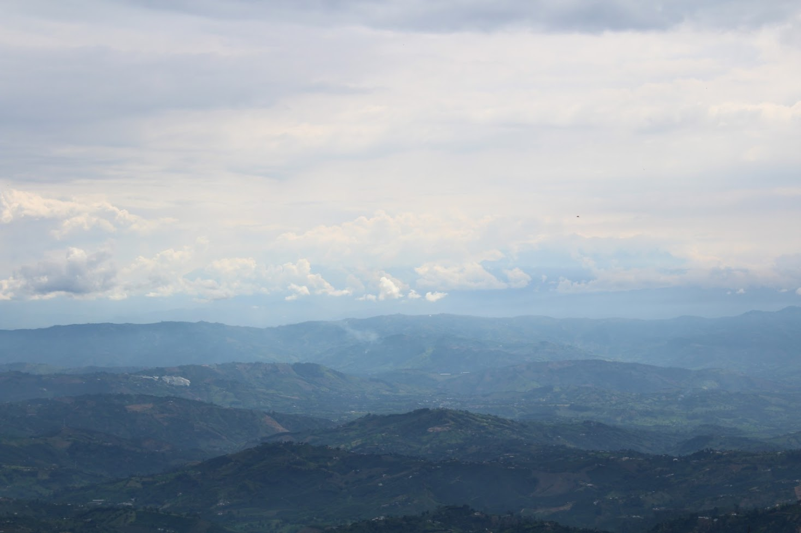

# Voronoi me

A Python script that takes an image and outputs a pixelated version using [Voronoi tessellations](https://en.wikipedia.org/wiki/Voronoi_diagram).

The script loads the image, places `n_points` random points in the image and uses them as the seeds in a Voronoi tessellation. Right now the script is somewhat slow, because I went with the overkill of computing the shortest distance of each pixel to the seeds using a [KDTree](https://en.wikipedia.org/wiki/K-d_tree#Nearest_neighbour_search).

## Usage

I assume you are running Python 3. You can create a new environment and install the requirements using

```
pip install -r requirements.txt
```

Then, you can run:

```
python process.py path_to_image.jpg
```

After running this script, the generated image will be saved as `out.jpg` in your working directory.

You can also specify two parameters: `out` (the path and name of the resulting image) and `n_points` (the amount of random points that are used as seeds in the tessellation). For example

```
python process.py example.jpg --out="example_50.jpg" --n_points=50
```

## Example




